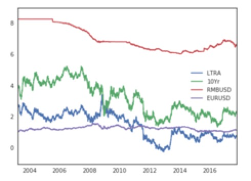
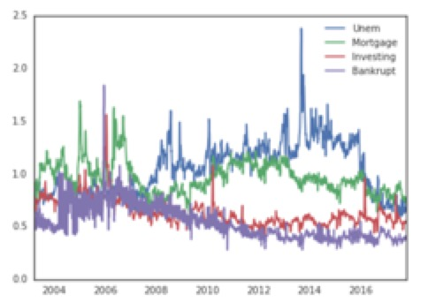
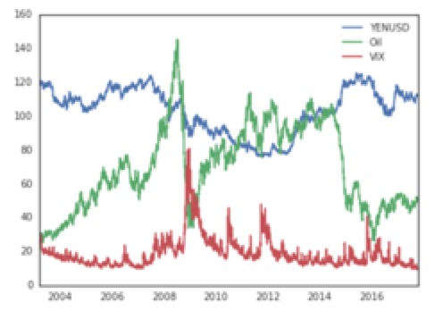
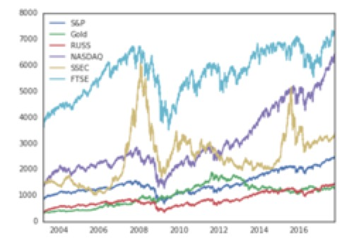
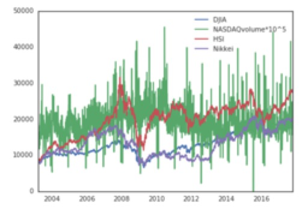

Guidelines:
Project midterm report. By this time, you should have made some progress in cleaning up and understanding your data, and in running a few preliminary analyses. Your project midterm report should be no more than 3 pages, written in LaTeX or markdown, and posted in your project repository with the filename “midterm_report”. (The file extension should be either .tex + .pdf, or just .md.)

In the report, you should describe your data set in greater detail. Describe how you plan to avoid over (and under-)fitting, and how you will test the effectiveness of the models you develop. Include a few histograms or other descriptive statistics about the data. How many features and examples are present? How much data is missing or corrupted? How can you tell? You should also run a few preliminary analyses on the data, including perhaps some regressions or other supervised models, describing how you chose which features (and transformations) to use. Finally, explain what remains to be done, and how you plan to develop the project over the rest of the semester.

## Introduction

Frank and Mike are day traders in XYZ Company. One day after the stock market closed, Frank felt extremely tired and was sick of all the time and work he needed to put into this job by just staring at multiple trading screens and performing routined trades. So he came up to Mike and said, "Wouldn't it be cool if we can find out the trend of NASDAQ 100 automatically and just do trades on that? We don't need to stare at the screens anymore!" Mike said, "You know what? That is an interesing idea. I know some students in Cornell that might be able to do this. Let's me talk to them and see if they can realize your idea." So here we are, helping these two lazy employees.

First of all, what NASDAQ 100 is? It is a stock market index that made up of 100 non-financial companies' securities that are listed on NASDAQ. Generally, its trend represents the situation of U.S's economy. In order to predict its trend, we need to find data that might capture NASDAQ's movement, and build a model to optimize the accuracy.

## Data set decription

Summary:

Our data set include daily data of Long Term Treasury Rate,	10 Year Treasury Bill Rate, USD/YEN, USD/RMB, USD/EUR, Oil Price, Gold Price, FTSE 100 Index, Nikkei 225 Index, S&P 500 Index, SSEC Index, VIX Index, Dow Jone Industrial Average, Russell 2000 Index, Hang Seng Index, Unemployment Google Trend Index, Mortgage Google Trend Index, Investing Google Trend Index, Bankrupcy Google Trend Index, NASDAQ Volume, and NASDAQ Index from 3/19/03 to 10/17/17.

Reasons For Choosing These Data:

1. Risk-free rate that represent the trend of macroeconomy: Long Term Treasury Rate,	10 Year Treasury Bill Rate
2. Exchange rates that represent international trade and its stability: USD/YEN, USD/RMB, USD/EUR
3. Commodity prices that represent industrial development and global risk measure: Oil Price, Gold Price
4. Different Indices that represent different countries and districts' economy: FTSE 100 Index, Nikkei 225 Index, S&P 500 Index,  SSEC Index, VIX Index, Dow Jone Industrial Average, Russell 2000 Index, Hang Seng Index, NASDAQ Volume
5. Different Topics' Google Trend Data that represent people's emotions and concerns towards these topics: Unemployment Google Trend Index, Mortgage Google Trend Index, Investing Google Trend Index, Bankrupcy Google Trend Index

You can see that our data look like a structured portfolio, and we think that features in this portfolio might impact NASDAQ Index in different ways. 

Messy Data Problem: 
1. There are some null values in data column Nikkei, Hang Seng, and SSEC. We decided to use the average of non-null values which days are before and after the null values' days, to fill these missing values.
2. Google Trend Data are continuous so they will include non-trading days, we also manage to delete those non-trading days' values to maintain consistency.

There are 20 features and 3618 examples for each feature.

## Features Analysis

Here is the heatmap of our features' correlation:
We can see that stock indices are highly correlated, and not much of this happen between stock indices and commodity. Suprisingly, Google trend indices show significant high correlation with risk-free rates and exchange rates.

Then we want to show plots of features. In order to make the trend more clear, we seperate them into different plots based on their scales:

2
